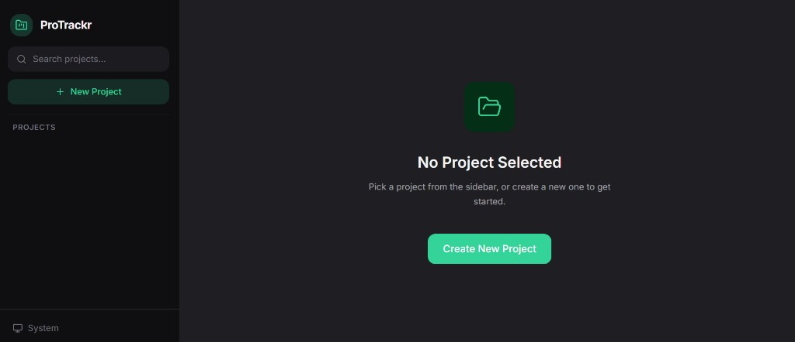

# ProTrackr

A task management app that doesn't try to be Jira. Create projects, break them into tasks, drag things around, and get stuff done — all client-side, no backend needed.

Built with React 19 + Zustand for state, Tailwind v4 for styling, and `@dnd-kit` for drag-and-drop.




## Quick Start

```bash
npm install
npm run dev
```

## What It Does

- **Projects** — create, search, delete (with confirmation so you don't nuke things by accident)
- **Tasks** — add, check off, inline edit, drag to reorder, delete
- **Persistence** — everything lives in localStorage via Zustand's persist middleware. Refresh all you want.
- **Dark mode** — respects your system preference, or toggle manually. Theme persists across sessions.
- **Keyboard shortcut** — `Ctrl+N` / `Cmd+N` to start a new project from anywhere
- **Responsive** — sidebar collapses to a hamburger on mobile


## Project Structure

```
src/
├── components/
│   ├── ui/          Button, Input, Modal, Badge, ConfirmDialog, EmptyState
│   ├── layout/      Sidebar, ThemeToggle
│   ├── project/     ProjectForm, ProjectHeader
│   └── task/        TaskInput, TaskItem, TaskList
├── hooks/           useKeyboardShortcut
├── store/           projectStore, themeStore
├── lib/             utils (cn, formatDate, generateId), constants
├── App.jsx
├── main.jsx
└── index.css        
```

## Dev Commands

| Command | What it does |
|---------|-------------|
| `npm run dev` | Dev server with HMR |
| `npm run build` | Production build → `dist/` |
| `npm run preview` | Serve the production build locally |
| `npm test` | Vitest in watch mode |
| `npm run test:run` | Single test run (good for CI) |
| `npm run lint` | ESLint |
| `npm run format` | Prettier |

## License

MIT
